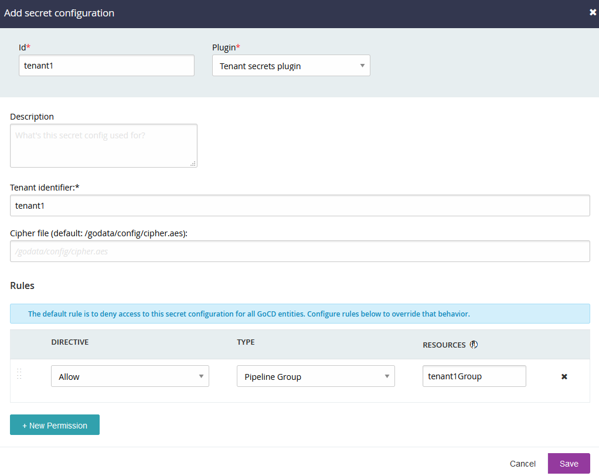

# GoCD tenantsecrets plugin


[](https://sonarcloud.io/dashboard?id=sandro-h_tenantsecrets)

GoCD secrets plugin that provides multi-tenant secrets.

It allows generating GoCD secrets that are bound to a pipeline group. A bound secret
cannot be decrypted in any other pipeline group. This prevents someone with access to
other pipeline configs (especially in the pipeline-as-code context) from copying the
secret and making GoCD decrypt it in their own pipeline.

## Installation

### Install plugin

* Download the latest version of the plugin from the [releases page](https://github.com/sandro-h/tenantsecrets/releases)
* Install it on the GoCD server as described in the [GoCD Plugin User Guide](https://docs.gocd.org/current/extension_points/plugin_user_guide.html).

### Install webservice

For users to generate secrets, there is a webservice that provides a UI and a REST endpoint.

The webservice can be run as a docker container. It is meant to be deployed on the same host as the GoCD server, for access to
its encryption key.

```shell
docker run -d -p 1717:1717 -v /path/to/gocd/cipher.aes:/config/cipher.aes:ro ghcr.io/sandro-h/tenantsecrets:latest
```

It provides the following entrypoints:

* GUI: <http://localhost:1717/secrets>
* REST: <http://localhost:1717/api/secrets>

See "Generating secrets" on how to use these entrypoints.

Note: The webservice only provides a HTTP endpoint. You're encouraged to use the same HTTPS termination as for the GoCD server (e.g. nginx).

## Administration

### Creating secret configs

GoCD admins have to create a secret configuration for each pipeline group that
wishes to use tenant secrets:

* **Id**: Use the pipeline group name for convenience
* **Cipher file**: Path to the master key for the encryption. We suggest using the GoCD server key (config/cipher.aes) for this.
* **Pipeline group**: The pipeline group to which the secrets will be bound.
* **Rules**: Make sure to restrict the secret config to the pipeline group.



### Pipeline group authorization

The security of tenant secrets relies on properly configured pipeline group authorization. Otherwise
an adversary can just place his pipeline into another pipeline group and read the secrets bound to that
pipeline group.

* For pipelines configured via UI: users should not be allowed to create their own pipelines in arbitrary pipeline groups.
* For pipeline-as-code configuration: Make sure to restrict config repos to specific pipeline groups.


## Generating secrets

### Via GUI

Once the webservice has been installed (see above), visit `http://localhost:1717/secrets` and
follow the instructions in the form.

### Via REST

POST your secret to `http://localhost:1717/api/secrets/<pipeline group>`.

Example curl call:

```shell
curl 'http://localhost:1717/api/secrets/my_group1' -s -H 'Content-Type: text/plain' -d "my secret"
```

The secret can be referenced in pipelines using the [secret param syntax](https://docs.gocd.org/current/configuration/secrets_management.html#step-4---define-secret-params).

```text
{{SECRET:[my_group1][AES:YZEax9ra1bkL6Td9:5dgUOEIZACwfZGcZoRu5]}}
```

For example in a YAML configuration:

```yaml
pipelines:
  mypipeline:
    group: my_group1
    environment_variables:
      LE_SECRET: "{{SECRET:[my_group1][AES:YZEax9ra1bkL6Td9:5dgUOEIZACwfZGcZoRu5]}}"
```

## Development

Build and run unit tests:

```shell
./gradlew build
```

To run the webservice locally in the IDE, you need to declare a cipher file. Easiest is to do so
in an `webservice/src/main/resources/application-default.yaml` file, which is never committed:

```yaml
tenantsecrets:
  cipherFile: /local/path/to/cipher.aes
```

Build docker image:

```shell
./gradlew bootBuildImage
```

Trigger a release on GitHub:

* Bump the `baseVersion` in `build.gradle`
* Push a release tag to trigger the release CI:

```shell
./gradlew release
```
